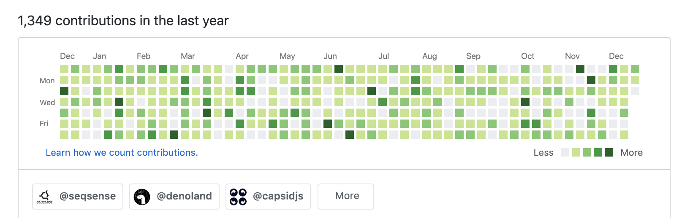
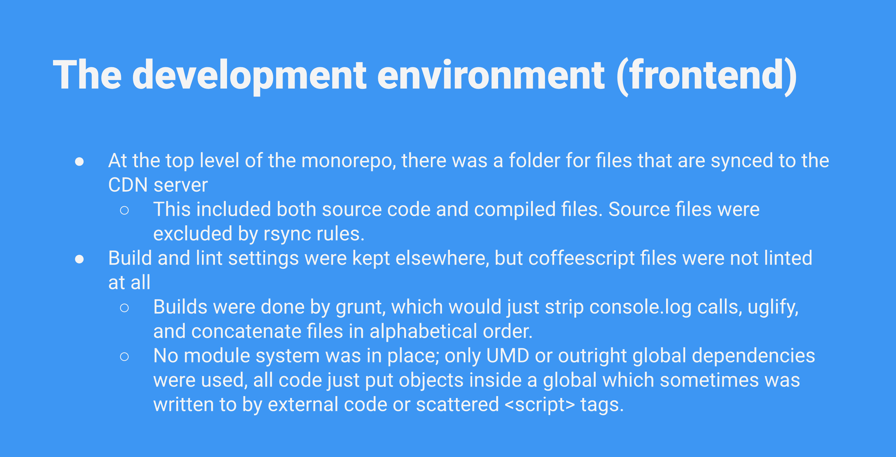

class: center, middle
# LT のススメ

日野澤 よしや

---
class: center, middle

社内勉強会で発表をしたことある人 🙋‍♀️🙋‍♂️

---
class: center, middle

"社外"の勉強会で発表をしたことある人 🙋‍♀️🙋‍♂️

---
class: center, middle

# 今日は LT (Lightning Talk) の話をします.

---
# LT とは

- Lightning Talk
- 5分から10分ぐらいで何か一つのことを喋るような発表
- LT を募集している勉強会が首都圏では毎週たくさんある

---
# 自己紹介

- 日野澤 歓也(よしや)
- LC では主に よしや!! と呼ばれています
- 2015 - 2019まで, RLS Air シリーズのフロントエンドに関わっていました.

 

---
# 最近話したLT

- nihonbashi.js
  - 第2回 OSS の話
  - 第3回 自作ライブラリの話
- ginza.js #5 Deno の話
- Deno 会 Deno 関連の話 x N

---
# LT をすると良いこと

- LT の内容について懇親会で話ができたりする
  - -> 知り合いが増える!!
  - -> そこから仕事に繋がったりも
- 採用プラットフォームが, 登壇歴をトラッキングしていたりする
  - -> 転職時に有利に働いたり

---
class: middle, center, inverse
# でも LT ってハードルが高そう

---
class: middle, center, inverse
# なにを話したらいいか 分からない

---
class: middle, center, inverse
# 話せるネタがない

---
# LT で何を話すか
- 最新技術の話, は, もちろん歓迎されますが,
- 必ずしも, 最新技術の話をしないといけない訳ではないです
- 業務上出てきた知見の紹介なども多い
  - 例. こういうチーム構成で, Vue.js を使ってこんな開発の仕方をしたら上手くいった
  - 成功した知見だけでなく, 失敗した知見の方が人気があったりする
  - 例. [セキュリティ事故物件 夜話](https://connpass.com/event/145230/)

---
# 「プレゼンの技術」
- [@cero_t(谷本)さん](https://twitter.com/cero_t)の[スライド](https://www.slideshare.net/shintanimoto/presentations-presentation-49449046)
- 技術プレゼンで話すべきことは何かの解説
- 1) 共感 2) 経験の共有 3) メッセージ(思想) の3点を伝えることが大事
  - プレゼン = 技術情報を伝達することではない
- (メモ: 時間があったら上のスライドをみんなで見る)

---
class: middle, center
# スライド作りの テクニック的な話

---
# ダメなスライドの例

---
# 何がダメ?

- 書きすぎ
- 文字が小さい, 読めない
- 伝わらない
- 話に集中できない

---
class: center, middle, inverse
じゃあ, どういうスライドを作れば良いの?

---
class: middle, center
伝わりやすいスライドのパターンの紹介

---
# スライド作りの〇〇メソッド
- # [高橋メソッド](https://ja.wikipedia.org/wiki/%E9%AB%98%E6%A9%8B%E3%83%A1%E3%82%BD%E3%83%83%E3%83%89)
- # [もんたメソッド](https://www.youtube.com/watch?v=LoaB2n8RaiI)
- ググると他にも[色々な](http://voidy21.hatenablog.jp/entry/20090904/1252077691)メソッドがあります
- 完全にこれらにそって作る必要はないですが, テンポの良いスライドを作りたい場合/場面で参考にしてみましょう

---
# まとめ
- LT をするといろいろ良いことがある
- LT では技術情報だけではなく, 経験やメッセージを伝える
- 見やすいスライドを作るためのテクニックを参考に

---
# おまけ: 勉強会にまずは参加してみましょう
- connpass.com で募集してる会が多い
- 一般参加者は基本的に話を聞くだけなのでハードルは低いです
- 自分に合ってそうな勉強会を探しましょう

---
# 都心部の JS 系勉強会

- Ginza.js
- Meguro.es
- Gotanda.js
- Roppongi.js
- Nihonbashi.js
- We are JavaScripter (特に初心者向けを意識しているらしいです)
- Node学園
- etc

---
# 勉強会参加のコツ
- まずは自分に合うかもしれない勉強会に参加してみましょう.
- 知り合いを1人以上連れて行くと懇親会で話が広がりやすいため, おすすめです.
- 合いそうだったらリピートしてみましょう
